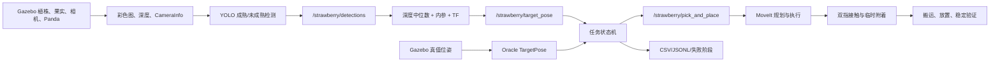

# 草莓 URP 新项目交接文档

- 交接日期：2026-07-25
- 仓库：`C:\Users\12753\Documents\New project\strawberry_urp`
- WSL 路径：`/mnt/c/Users/12753/Documents/New project/strawberry_urp`
- 项目题目：基于 ROS 2、YOLO 与 Gazebo 的草莓成熟度识别及机械臂抓取搬运仿真研究
- 硬截止日期：2027-03-01

## 1. 一句话现状

ROS 2 仿真、RGB-D、TF、三维定位、MoveIt、双指接触、临时附着、
抓取搬运、状态机、实验记录和复现发布链均已实现。旧球形场景已经
完成一次完整项目发布，但正式 P3 结果失败；2026-07-25 又把默认场景
升级为 Blender 草莓植株，新场景的 Oracle 抓放已经成功，视觉目前只能
稳定识别三颗果实中的一颗成熟果，尚未通过新版场景的感知或端到端验收。

## 2. 不可混淆的两条证据线

### 2.1 v1：旧球形桌面场景

- 三颗果实是红/绿球形刚体。
- v1 是 P3、P4、P5、P6 正式证据的来源。
- 旧场景已归档为：
  - `ros2_ws/src/strawberry_sim/worlds/strawberry_tabletop_benchmark_v1.sdf`
  - `ros2_ws/src/strawberry_sim/config/scene_tabletop_v1.yaml`
- 2026-07-24 的发布包
  `artifacts/p6/strawberry_urp_release_v1.zip` 属于这条证据线。

### 2.2 v2：当前 Blender 植株场景

- 默认世界现在是
  `ros2_ws/src/strawberry_sim/worlds/strawberry_orchard.sdf`。
- 包含花盆、植株、叶片、果梗、2 颗成熟果、1 颗未成熟果、Panda、
  固定 RGB-D 相机和收集箱。
- v2 在 v1 发布完成后才加入，所以不能继承 v1 的 P3/P4 正式指标。
- v2 当前只有开发诊断：
  - Oracle 完整抓放：通过；
  - 60 帧无运动视觉 Shadow：部分通过；
  - v2 正式感知、定位、端到端和鲁棒性门：尚未重新冻结或运行。

以后引用实验结果时必须明确写 `v1 tabletop` 或 `v2 Blender plant`。

## 3. 固定技术边界

- Windows 11 + WSL2。
- WSL 发行版：`Ubuntu-24.04-URP`。
- Ubuntu 24.04、ROS 2 Jazzy、Gazebo Harmonic、MoveIt 2。
- GPU：RTX 4060 Laptop，8 GB；不使用云端训练。
- 固定式眼在手外 RGB-D 相机。
- 基坐标系：`panda_link0`。
- 使用仿真时钟，距离单位为米。
- 只做仿真，不做实体机器人、sim-to-real 声明、多相机融合、果柄剪切、
  柔性果实或自研运动规划器。
- 草莓是刚体；双指接触后通过临时附着约束搬运。
- 叶片和枝梗在 v2 中主要是视觉遮挡物，不模拟柔性接触或损伤。
- 真实图像正式测试集仍然封存，从未消费。

### 原始验收阈值

- 感知：独立真实测试集成熟/未成熟宏平均 F1 ≥ 0.85。
- 定位：至少 100 个真值点，中位误差 ≤ 15 mm，P95 ≤ 30 mm。
- 规划：真值目标可达场景成功率 ≥ 90%，规划时间 P95 ≤ 5 s。
- 端到端：135 次正例总体成功率 ≥ 80%。
- 负例：未成熟果错误抓取率 ≤ 5%。
- 失败必须归因到感知、深度、TF、可达性、规划、抓取或放置。

这些阈值从未因结果不理想而下调。

### 已确认的对话决策

- 标签双人审核的分歧项一律保守排除，不由模型预测自动补标签。
- 当前低于 0.85 的模型可以用于有限仿真工程推进，但不能改写为数值达标。
- 正式真实测试集继续封存。
- Oracle 用于隔离验证定位、规划和抓放，不能替代视觉验收。
- 不再对同一正式 claim 做行为重跑或对失败结果挑选性删除。
- Git 活动更改问题此前按用户要求暂时忽略，尚未建立干净提交基线。
- 用户要求可视化时使用有头 Gazebo；批量实验仍使用 headless。
- 用户确认旧场景过于简略后，提供两个 Blender 文件并授权替换默认环境。

## 4. 系统架构



Oracle 和视觉控制必须保持来源隔离。Oracle 可以证明机械臂链路，
但不能证明 YOLO 合格。

### 固定接口

- `StrawberryDetection.msg`
  - 目标 ID、成熟度、置信度、边界框。
- `StrawberryDetectionArray.msg`
  - 同一采图时间戳下的检测集合。
- `TargetPose.msg`
  - 目标 ID、`PoseStamped`、置信度、位置不确定度。
- `PickAndPlace.action`
  - 输入目标位姿和放置位姿；
  - 输出成功状态、失败码、规划时间和执行时间。

接口源文件位于：

- `ros2_ws/src/strawberry_interfaces/msg/`
- `ros2_ws/src/strawberry_interfaces/action/PickAndPlace.action`

状态机为：

`初始化 → 采图 → 检测 → 定位 → 目标选择 → 规划 → 接近 → 抓取 →
抬升 → 搬运 → 放置 → 验证`

安全规则：

- 只选择成熟且深度、TF、IK 有效的目标。
- 无成熟果返回 `NO_PICK`，机械臂不运动。
- 深度或 TF 失败最多重取 3 帧。
- 规划失败只尝试 1 次备用接近方向。
- 抓取失败后张开夹爪、回安全位并结束，不允许无限重试。

## 5. ROS 包与主要代码地图

| 包 | 职责 | 关键位置 |
|---|---|---|
| `strawberry_interfaces` | ROS 消息和 Action | `ros2_ws/src/strawberry_interfaces/` |
| `strawberry_sim` | Gazebo 世界、模型、相机、真值、接触、附着 | `ros2_ws/src/strawberry_sim/` |
| `strawberry_perception` | YOLO 推理、Shadow 诊断、帧窗采样 | `ros2_ws/src/strawberry_perception/strawberry_perception/` |
| `strawberry_localization` | 深度中位数、投影、TF、真值关联 | `ros2_ws/src/strawberry_localization/strawberry_localization/` |
| `strawberry_manipulation` | MoveIt、场景碰撞、抓放 Action | `ros2_ws/src/strawberry_manipulation/strawberry_manipulation/` |
| `strawberry_bringup` | 系统组合、Oracle 提供器、试验状态机 | `ros2_ws/src/strawberry_bringup/` |
| `strawberry_benchmark` | 场景矩阵、指标、失败归因、门禁 | `ros2_ws/src/strawberry_benchmark/` |

最重要的运行入口：

- 全系统启动：
  `ros2_ws/src/strawberry_bringup/launch/system.launch.py`
- 单独仿真：
  `ros2_ws/src/strawberry_sim/launch/sim.launch.py`
- 抓放服务器：
  `ros2_ws/src/strawberry_manipulation/strawberry_manipulation/action_server.py`
- MoveIt 场景代理：
  `ros2_ws/src/strawberry_manipulation/strawberry_manipulation/scene_geometry.py`
- YOLO 节点：
  `ros2_ws/src/strawberry_perception/strawberry_perception/perception_node.py`
- 定位节点：
  `ros2_ws/src/strawberry_localization/strawberry_localization/node.py`
- 状态机：
  `ros2_ws/src/strawberry_bringup/strawberry_bringup/orchestrator.py`

## 6. 数据集与当前视觉模型

主数据源为 Zenodo 草莓检测数据集 6126677，许可 CC BY 4.0。

- 原始归档：
  `data/raw/zenodo_6126677/strawberries.zip`
- 划分：
  - 训练：501 张；
  - 验证：116 张；
  - 封存测试：115 张。
- 正式测试图像和标签从未访问。

### 标签审核

- 验证集审核采用双人审核。
- 已冻结“分歧项一律保守排除”的规则。
- 训练标签审核共 34 个候选：
  - 18 个一致；
  - 16 个分歧并排除；
  - 最终应用 13 个共识修改：5 个重标、8 个新增框。
- 原始数据没有被覆盖，修改写入版本化衍生数据。

### 当前工程使用的模型

- 变体：`yolo11s_640_train_audit_v1`
- 权重：
  `outputs/perception/yolo11s_640_train_audit_v1/weights/best.pt`
- SHA-256：
  `e3aca77e627469a1e9cf43c0776438623d881332163e03afe1fbcc55aba1af70`
- 输入尺寸：640。
- 冻结置信度阈值：0.58。
- 真实审核验证集：
  - 宏平均 F1：0.800675；
  - 成熟 F1：0.887064；
  - 未成熟 F1：0.714286；
  - 要求：宏平均 F1 ≥ 0.85。

因此：

- T30 数值门没有通过；
- ADR 0026 仅允许该模型用于有限仿真工程控制；
- 不得把它写成真实图像模型“已达标”；
- 不得据此开启正式真实测试集；
- 不得声称 sim-to-real 成功。

权威记录：

- `artifacts/perception/t30_train_audit_outcome_handoff_v1.json`
- `config/p3_perception_control_waiver_v1.json`
- `docs/decisions/0026-accept-below-gate-model-for-simulation-control.md`

曾进行一次真实图像 + 合成图的模拟域适配。候选在合成验证上达到
1.000，但真实审核验证宏 F1 降到 0.625537，因此被 ADR 0022 拒绝，
不能再把这次失败候选提升为运行模型。

## 7. v1 正式结果

### P3 正式 135 + 30 场景矩阵

- 正例：135 次。
- 成功：39 次。
- 正例成功率：28.89%，要求 ≥ 80%。
- 负例：30 次，安全 `NO_PICK` 为 30/30。
- 失败归因：
  - 感知：84；
  - 抓取：12。
- 遮挡分组：
  - 无遮挡：33/45；
  - 部分遮挡：6/45；
  - 重遮挡：0/45。
- 定位误差：
  - 中位数：6.46 mm；
  - P95：24.58 mm。
- 规划时间 P95：0.0685 s。

结论：规划和负例安全正常，正式 P3 失败的主要原因是视觉与遮挡。
正式行为矩阵的单次 claim 已消费，不允许把失败结果删除后重跑。

权威记录：

- `artifacts/p3/p3_formal_matrix_outcome_handoff_v1.json`
- `docs/decisions/0030-record-formal-p3-simulator-matrix-outcome.md`

### P4 单次干预

- 无遮挡成熟检测：稳定。
- 重遮挡时成熟检测达到 300/300 帧；
- 但重遮挡目标位姿为 0/300。
- 根因：边界框中心深度采到了前景遮挡物，三维点距离真实果实
  0.345–0.366 m，超过 0.08 m 真值关联门，因此定位节点安全地不发布
  `TargetPose`。

结论：仅换视觉 checkpoint 不能修复单视角中心深度在重遮挡下的几何
问题。该单次 P4 干预被拒绝，没有授权第二次 P4 干预或新正式矩阵。

权威记录：

- `artifacts/p4/p4_sim_adapt_qualification_outcome_handoff_v1.json`
- `docs/decisions/0032-reject-single-p4-simulator-perception-intervention.md`

### P5/P6 发布

- v1 清洁复现、报告、视频和发布归档已经完成。
- 发布包：
  `artifacts/p6/strawberry_urp_release_v1.zip`
- SHA-256：
  `0f306c8503bc54b03b16304a428387cdf5cf282661efd4323066fe53fd68d22a`
- 发布包保留了所有失败结论，没有伪造验收成功。
- 该归档早于 Blender v2 场景，不包含 v2 的最新改动。

## 8. Blender v2 场景实现

用户提供：

- `strawberry_ripe_visual_v1.blend`
- `Untitled1.blend`

仓库内保留为：

- `assets/blender_sources/strawberry_ripe_visual_v1.blend`
- `assets/blender_sources/strawberry_plant_v2.blend`

导出工具：

- `tools/blender/inspect_blend_scene.py`
- `tools/blender/export_gazebo_assets.py`
- `tools/blender/README.md`

运行格式为 OBJ + MTL，并封装成 Gazebo SDF：

- `ros2_ws/src/strawberry_sim/models/strawberry_ripe/`
- `ros2_ws/src/strawberry_sim/models/strawberry_unripe/`
- `ros2_ws/src/strawberry_sim/models/strawberry_plant_v2/`

导出约束：

- 果实包含果肉、种子、萼片；
- 排除果实源文件中的长弯曲果梗，避免与植株果梗重复；
- 植株只导出根冠、叶片、叶柄、花序和果梗；
- 排除植株文件里导入的模板和重复果实；
- 果实原点位于果肉中心；
- 萼片中心直接连接 Blender 果梗端点；
- 保留三颗独立刚性果实：1、3 成熟，2 未成熟；
- 第四根果梗保留为空枝，不扩展现有三目标接口。

轻量化后：

- 每颗果实：18,150 个三角面；
- 植株：17,129 个三角面；
- 三颗果实加植株：71,579 个三角面；
- 轻量化前约 306,316 个三角面。

物理近似：

- 果实碰撞半径：26 mm；
- 花盆和根冠进入 Gazebo 与 MoveIt 碰撞场景；
- 叶片、叶柄和果梗主要提供视觉遮挡；
- 果实关闭重力，抓取后由临时约束附着。

资产溯源和架构决策：

- `docs/assets/blender-asset-provenance-v2.md`
- `docs/decisions/0036-adopt-blender-plant-scene-v2.md`

## 9. Blender v2 最新验证

### 9.1 静态、构建和运行

- Blender 导出重复运行后 OBJ 哈希一致。
- 3 个新默认 SDF 模型和 12 个历史资产变体均通过校验。
- 6 个受影响 ROS 包重新构建成功。
- 依赖较轻的源测试共运行 378 项：
  - 377 通过；
  - 1 项按环境条件跳过；
  - 0 失败，0 错误。
- 8 秒运行健康测试通过，彩色、深度、`CameraInfo`、关节状态和三路
  真值均存在。
- 固定相机截图：
  `artifacts/sim/blend_inspection/canonical_plant_scene.png`

### 9.2 Oracle 抓放

- 新植株场景中对 `strawberry_1` 完成一次完整抓放。
- 双指原始接触：通过。
- 临时附着、抬升、搬运、放置、稳定验证：通过。
- 规划时间：0.0332 s。
- 未碰撞其他果实。
- 结果：
  `results/development/blender_scene_v2_oracle_smoke_v4/summary.json`

这证明新资产的碰撞代理、MoveIt、接触和抓放链可工作，但不证明视觉。

### 9.3 视觉 Shadow

固定模型、阈值 0.58、10 帧预热后采集 60 帧：

- 任意检测：60/60；
- 至少一颗成熟果：60/60；
- 未成熟果：0/60；
- `TargetPose`：60/60；
- 每帧恰好 1 个成熟框；
- 目标始终是 `strawberry_1`；
- 置信度约 0.652302；
- `strawberry_3` 和 `strawberry_2` 未恢复。

因此 v2 将旧的“仿真中 0 个成熟检测”改善成“稳定识别一颗成熟果”，
但当前固定视角的对象覆盖仍是：

- 成熟：1/2；
- 未成熟：0/1；
- 总计：1/3。

证据：

- `docs/blender-scene-v2-shadow-diagnostic-v1.md`
- `results/development/blender_scene_v2_shadow_60f_v1/shadow_window.json`
- `scripts/run_blender_scene_v2_shadow_window.sh`

## 10. 当前真实阶段状态

| 模块/阶段 | 当前状态 |
|---|---|
| T10 环境与工程基线 | 完成 |
| T20 Gazebo 场景 | v1 完成；v2 已替换默认场景并通过基本运行 |
| T30 数据与 YOLO | 工程完成，数值门失败；只获仿真工程豁免 |
| T40 深度定位与 TF | v1 指标可用；v2 只验证了 1 号果位姿可发布 |
| T50 MoveIt 抓取搬运 | 新旧场景均已证明基本链路可用 |
| T60 状态机与集成 | 实现完成 |
| P3 正式端到端 | v1 失败；v2 尚未重新冻结或运行 |
| P4 鲁棒性 | v1 单次干预失败；v2 尚无正式鲁棒性结果 |
| P5/P6 发布 | v1 已完成；v2 尚未生成新发布包 |

不能把项目描述为“全部完成，只差视觉模型”。更准确的表述是：

> 工程架构与机械臂闭环已经完成；v1 已按失败结论正式收口；v2 场景升级
> 已完成基本抓放，但 v2 的视觉覆盖、定位参数和正式端到端评测仍待完成。

## 11. 未解决问题与技术债

### 11.1 当前第一问题：分不清遮挡问题还是外观域问题

当前只知道 1 号成熟果稳定被识别，3 号成熟果和 2 号未成熟果没有识别。
尚不能判断是：

- 叶片遮挡；
- 相机角度；
- 果实像素尺寸；
- 果实朝向；
- 绿色未成熟果与叶片颜色混淆；
- YOLO 对 Blender 材质仍存在域差异。

### 11.2 v2 定位偏移仍沿用 v1 半径

当前默认果实碰撞半径已经从 35 mm 改为 26 mm，但：

- `ros2_ws/src/strawberry_localization/config/localization.yaml`
  仍有 `surface_to_center_offset_m: 0.035`；
- `strawberry_localization/localization_gate.py` 的历史球形门仍使用
  `FRUIT_RADIUS_M = 0.035`。

这不影响“有没有发布 TargetPose”的 Shadow 结论，但在声称 v2 定位
误差前必须处理。推荐增加显式的场景参数：

- v2 Blender：0.026；
- v1 legacy：0.035。

不要直接覆盖历史 v1 参数，否则会破坏旧门的可复现性。

### 11.3 v2 尚未获得正式证据

- 当前 60 帧来自固定相机、固定场景、静态画面；
- 不代表位置、光照、遮挡或随机种子鲁棒性；
- 不代表 80% 端到端成功率；
- 不代表未成熟误摘率 ≤ 5%；
- v1 的 135 + 30 正式矩阵不能迁移为 v2 结论。

### 11.4 Git 与发布

- 仓库历史上存在大量活动/未跟踪更改，VS Code 会限制部分 Git 功能。
- 此前用户要求暂时忽略 Git，因此当前没有可依赖的干净提交基线。
- 在新项目进行大改前，应先人工确认范围并建立一次明确的 v2 基线提交
  或独立归档。
- `.codex_tmp/` 中可能仍有约 1.4 GB 的便携 Blender 临时文件，已被
  `.gitignore` 忽略；运行时不依赖它，确认不再导出后可人工删除。

## 12. 推荐的下一步顺序

### 第一步：三果隔离诊断，不训练

固定同一模型、阈值、相机和光照，分别只留下：

1. `strawberry_1`：成熟，作为已知阳性对照；
2. `strawberry_3`：成熟，判断是遮挡/姿态还是模型不识别；
3. `strawberry_2`：未成熟，判断绿色果实是否存在类别域问题。

每个场景先做无运动固定帧窗。建议 10 帧预热 + 60 帧测量，记录：

- 检测帧率；
- 类别；
- 置信度；
- 目标 ID；
- `TargetPose` 可用率；
- ROI 像素尺寸与叶片遮挡比例。

解释规则：

- 隔离后能识别：主要是植株布局、遮挡或相机问题；
- 隔离后仍不能识别：主要是外观、材质、尺寸、姿态或模型域问题；
- 检测有但位姿无：进入深度中心区域和 TF/关联诊断。

### 第二步：修复 v2 场景参数契约

- 为定位表面到中心偏移增加 v1/v2 显式参数；
- v2 使用 0.026，v1 保留 0.035；
- 添加测试，禁止世界、碰撞半径和定位偏移静默漂移；
- 重新做 v2 至少 100 个真值点定位门。

### 第三步：根据隔离结果只选一种干预

- 如果是遮挡/相机：
  - 调整固定相机或果实挂点；
  - 保留自然植株，不退回漂浮球；
  - 先做无运动复测。
- 如果是外观域：
  - 优先改善 Blender/Gazebo 材质、未成熟果颜色和真实形态；
  - 或冻结一次有限的 simulator-only 合成微调；
  - 必须保持真实验证非回退检查；
  - 不声称 sim-to-real。
- 如果是中心深度：
  - 考虑分割掩膜、bbox 多区域深度、与真值无关的几何过滤；
  - 不能用 Gazebo 真值替代正式视觉定位。

### 第四步：逐层升级验证

1. v2 三果静态 Shadow；
2. v2 多位置、光照和自然遮挡 Shadow；
3. v2 单次 perception-controlled 抓放；
4. v2 小规模重复开发门；
5. 只有在前面稳定后，另写 ADR 冻结 v2 正式矩阵；
6. 最终生成独立的 v2 报告、视频和发布包。

不要直接重跑 v1 的正式 claim，也不要直接开始新一轮盲目训练。

## 13. 常用命令

进入项目：

```powershell
wsl -d Ubuntu-24.04-URP
cd "/mnt/c/Users/12753/Documents/New project/strawberry_urp"
```

完整构建和测试：

```bash
bash scripts/build_and_test.sh
```

观看当前 Blender v2 场景：

```bash
bash scripts/show_canonical_scene.sh
```

抓取固定相机画面：

```bash
STRAWBERRY_COLCON_ROOT="$PWD/ros2_ws" \
  bash scripts/capture_canonical_scene_frame.sh
```

重新运行 v2 Shadow 时必须使用新输出目录，因为脚本拒绝覆盖证据：

```bash
STRAWBERRY_COLCON_ROOT="$PWD/ros2_ws" \
  bash scripts/run_blender_scene_v2_shadow_window.sh \
  "$PWD/results/development/blender_scene_v2_shadow_60f_v2" \
  "$PWD/outputs/perception/yolo11s_640_train_audit_v1/weights/best.pt" \
  226
```

运行一次新的 Oracle 开发冒烟：

```bash
STRAWBERRY_COLCON_ROOT="$PWD/ros2_ws" \
  bash scripts/run_oracle_pick_gate.sh \
  1 227 \
  "$PWD/results/development/blender_scene_v2_oracle_smoke_v5"
```

旧 v1 场景只用于历史兼容：

```bash
ros2 launch strawberry_sim sim.launch.py \
  world_file:="$(ros2 pkg prefix strawberry_sim)/share/strawberry_sim/worlds/strawberry_tabletop_benchmark_v1.sdf" \
  scene_config_file:="$(ros2 pkg prefix strawberry_sim)/share/strawberry_sim/config/scene_tabletop_v1.yaml"
```

## 14. 新任务可直接使用的启动提示词

```text
你接手的是草莓 URP 仿真项目，仓库位于：
C:\Users\12753\Documents\New project\strawberry_urp

请先完整阅读：
1. docs/NEW_PROJECT_HANDOFF_2026-07-25.md
2. docs/decisions/0036-adopt-blender-plant-scene-v2.md
3. docs/blender-scene-v2-shadow-diagnostic-v1.md
4. artifacts/perception/t30_train_audit_outcome_handoff_v1.json
5. artifacts/p3/p3_formal_matrix_outcome_handoff_v1.json

重要边界：
- v1 球形场景的正式 P3 结果是 39/135，不能改写或重跑 claim。
- 真实图像测试集仍封存，不能访问。
- 当前工程模型宏 F1=0.800675，阈值=0.58，只是仿真工程豁免。
- Blender v2 Oracle 抓放已成功，但60帧视觉只能识别 strawberry_1；
  strawberry_3 和 strawberry_2 未识别。
- v2 果实半径为0.026 m，而定位默认偏移仍为0.035 m；在做v2定位
  指标前必须按场景参数化，且保留v1的0.035历史路径。

下一任务不是训练，也不是正式矩阵。请先实现并运行三果隔离的无运动
诊断：分别只保留 strawberry_1、strawberry_3、strawberry_2，固定当前
模型、阈值0.58、相机和光照，每个场景10帧预热+60帧测量，输出检测类别、
置信度、目标ID、TargetPose可用率和ROI/遮挡统计。根据结果判断问题属于
遮挡/相机、外观域，还是深度定位。所有输出必须使用新目录且不得覆盖
现有证据。
```

## 15. 最权威的阅读顺序

1. 本文。
2. `README.md`。
3. `docs/decisions/0036-adopt-blender-plant-scene-v2.md`。
4. `docs/assets/blender-asset-provenance-v2.md`。
5. `docs/blender-scene-v2-shadow-diagnostic-v1.md`。
6. `artifacts/perception/t30_train_audit_outcome_handoff_v1.json`。
7. `artifacts/p3/p3_formal_matrix_outcome_handoff_v1.json`。
8. `artifacts/p4/p4_sim_adapt_qualification_outcome_handoff_v1.json`。
9. `artifacts/p6/p6_delivery_handoff_v1.json`。
