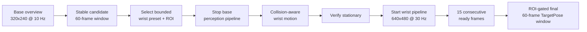

# Dual-camera sequential observation development baseline v1

- Date: 2026-07-26
- Scope: non-acceptance development diagnostic
- Scene: Blender plant v2
- Camera mode: `camera_mount:=dual`
- Control boundary: observation only; `pick_authorized=false`

## Purpose

This work implements sequential camera cooperation without image or point-cloud
fusion. The base camera finds a coarse ripe candidate and selects one bounded
wrist pose. Base inference is then stopped before the arm moves. After MoveIt
reaches the chosen pose with all three fruit represented as collision
obstacles, the wrist pipeline starts and localizes only detections inside the
selected attention region.



No inference process is active during the arm motion. The transition authorizes
only a wrist observation, never a pick.

## Base overview result

The frozen engineering-waived model at threshold 0.58 was routed to
`/camera/base/*` for ten warmup plus 60 measured frames:

- ripe detection: 60/60 frames;
- localized identity: `strawberry_1` in 60/60 frames;
- confidence: 0.588416636;
- ROI: 16x15 pixels, 240 pixels squared;
- unripe detection: 0/60 frames;
- robot motion: none.

Evidence:
`results/development/dual_base_overview_shadow_60f_v1/shadow_window.json`,
SHA-256
`aabee1b2f85f69eff6aacd87b0c1337a9fff1e8b335876c4b35c394c964380e9`.

This is enough to choose a coarse observation preset, but the confidence is
only 0.0084 above the engineering threshold and the fruit is very small. The
base result must not be used as final grasp localization.

The selector requires one identity in at least 48 of 60 frames. It currently
maps:

| Base identity | Wrist preset | Pixel attention ROI |
|---|---|---|
| `strawberry_1` | `lower` | `[320, 240, 640, 480]` |
| `strawberry_3` | `center` | `[0, 0, 320, 480]` |

Missing, weak, tied, or unmapped candidates fail closed. Identity in this
diagnostic comes from simulator ground-truth association after visual
localization; it is not a real-world tracking solution.

## Two wrist views

The original `center` pose places `strawberry_1` below the image. Its final
collision-aware window reports:

| Preset | Visible ripe detections | Selected identity | TargetPose | Unripe detections |
|---|---:|---|---:|---:|
| `center` | 1 per frame | `strawberry_3` | 56/60 | 0/60 |
| `lower` | 2 per frame | `strawberry_1` | 60/60 | 0/60 |

The `lower` pose keeps the hand position `[0.28, 0.0, 0.72]` m and changes the
hand orientation to XYZW
`[0.0, 0.9537169507, 0.0, 0.3007057995]`. Its right-lower attention region
selects `strawberry_1` even though the upper `strawberry_3` detection has
slightly higher confidence.

Evidence:

- center:
  `results/development/dual_camera_wrist_shadow_60f_v3/shadow_window.json`,
  SHA-256
  `2f75cfd0442c72dd5d061bdebbb5fa7934deb35e526754ac7b544ed4f3c1cb7c`;
- lower:
  `results/development/dual_camera_wrist_lower_shadow_60f_v2/shadow_window.json`,
  SHA-256
  `be6535a6684af204d7e565d45ec49f83d902228482b7854abd3fbf7d55978b49`.

Together, the two settled poses provide final target-pose coverage for both
ripe fruit identities in separate development windows. They do not detect the
unripe fruit even though it is clearly visible in the lower RGB image. That
strengthens the engineering diagnosis that the remaining unripe failure is an
appearance/model-domain problem rather than simple camera occlusion, but it is
not a formal accuracy result.

## Same-world sequential run

`scripts/run_dual_sequential_observation.sh` runs both stages in one Gazebo
world and records an explicit state history. The final v2 result:

- base candidate: `strawberry_1`, 60/60 support;
- selected preset: `lower`;
- base perception/localization stopped before motion;
- fruit collision obstacles during motion: IDs 1, 2, and 3;
- MoveIt planning: 0.036199 s;
- motion execution: 9.920841 s;
- wrist detections: 120 in 60 frames;
- matching wrist TargetPose: `strawberry_1`, 52/60 frames;
- unexpected wrist identities: none;
- violations: none;
- sequence passed: true;
- pick authorized: false.

Evidence:
`results/development/dual_sequential_observation_v2/sequence_summary.json`,
SHA-256
`69d164225cb9a3d291b8dadb7cfec2ecdb4e6fd1a2c7494be4f466bc01e0b9dc`.

The first same-world attempt is retained at
`results/development/dual_sequential_observation_v1`. Renaming the manually
started nodes prevented their name-scoped YAML from applying
`use_sim_time=true`; localization therefore rejected every mixed-clock sample
and the selector failed closed. The runner now passes the clock parameter
explicitly to all four stage processes. That directory is infrastructure
defect evidence, not a visual result.

## Timing diagnosis and bounded hardening

The original same-world result retained visual detections in all 60 frames but
published only 52 TargetPose messages. Frame-by-frame logs proved that this was
not a model or wrist-pose regression:

- both the standalone and same-world windows had 120 ripe boxes in 60 frames;
- same-world detection confidence was slightly higher;
- five missing poses had no depth/CameraInfo pair inside the nominal 50 ms
  bound;
- three missing poses were caused by TF being 11--17 ms behind the detection;
- the manually restarted wrist pipeline had burstier timestamps and a cold TF,
  joint-state, and sensor cache.

The observation-only localization path now adds four bounded mechanisms:

1. a multithreaded executor with separate sensor and localization callback
   groups, so TF waits do not stop depth, CameraInfo, and joint-state receipt;
2. timestamp/cache diagnostics on every rejected localization;
3. a freshness-limited deferred queue that retries when matching depth or TF
   arrives, but expires at the existing 0.5 s sensor-age gate;
4. an opt-in stationary-only sensor synchronization fallback.

The nominal synchronization bound remains 50 ms. The sequential wrist runner
opts into a 105 ms stationary bound only after five fresh joint samples prove
all Panda joints stayed within 0.002 rad. This value covers the observed 99 ms
Gazebo bridge hole and remains below two approximately 15 Hz depth periods.
Motion never uses the wider bound. Generic localization defaults keep this
fallback disabled.

The Shadow probe no longer treats ten arbitrary detections as readiness. It
requires 15 consecutive detection timestamps with a matching TargetPose, then
starts a new 60-frame measurement window. The sequence finalizer rejects
missing or shorter readiness evidence.

The intermediate five-run diagnostic at
`results/development/dual_sequential_repeat_v7_v12_pre105.json` is intentionally
retained as failed evidence: 299/300 matching TargetPose frames, with one 99 ms
depth hole, SHA-256
`35349c2b1e67f036b7323482695e156feaf5a7b1dd28fb55d30d09c7822a69ff`.

## Five fresh-world repeat

Five consecutive fresh worlds using the final bounded policy are recorded in
`dual_sequential_observation_v13` through
`dual_sequential_observation_v17`:

| Run | Base support | Wrist TargetPose | Stationary sync fallback | Deferred recovery | Clean shutdown |
|---|---:|---:|---:|---:|---|
| v13 | 60/60 | 60/60 | 3 | 0 | yes |
| v14 | 60/60 | 60/60 | 13 | 0 | yes |
| v15 | 60/60 | 60/60 | 1 | 0 | yes |
| v16 | 60/60 | 60/60 | 5 | 0 | yes |
| v17 | 60/60 | 60/60 | 15 | 2 | yes |

Aggregate result:

- base candidate: target 1 in 300/300 frames;
- selected wrist preset: `lower` in 5/5 worlds;
- wrist ripe detections: 600 boxes in 300 frames;
- matching wrist TargetPose: target 1 in 300/300 frames;
- unripe detections: 0;
- unexpected target identities: 0;
- run-log Traceback / process failure: 0;
- pick authorized: false in every run;
- repeat passed: true.

Evidence:
`results/development/dual_sequential_repeat_v13_v17/summary.json`,
SHA-256
`8f27f7c426d1143967163f1267534e08639976588c989dd97041452087056897`.

This is a development repeatability result, not formal perception acceptance
and not permission to pick. The green unripe fruit remains visible but
undetected, so the appearance/model-domain limitation is unchanged.

## Observation-to-control handoff Shadow

The same-world runner now continues into a control-side, no-motion audit after
the wrist 60-frame window. `strawberry_manipulation.handoff_shadow` requires:

- 15 coherent TargetPose receipts for the base-selected identity;
- acquisition age no greater than 0.5 s in `panda_link0`;
- 10 complete Panda arm samples with no joint range above 0.002 rad;
- a second live-state stationarity check inside MoveIt;
- all four static collision objects and all three fruit collision objects;
- the selected fruit collision object to remain present;
- no pick action call, trajectory command, gripper command, controller
  configuration, or pick authorization.

Samples received before the probe's simulated clock catches up are counted as
pipeline-not-ready and are not admitted into the 15-sample handoff window. A
small genuinely future timestamp is still rejected. The read-only MoveIt
configuration strips the controller and trajectory-execution keys; runtime
logs must contain no instantiated FollowJointTrajectory or GripperCommand
controller.

Development failures are preserved rather than overwritten. They include two
collision-checked observation planning rejections, an incorrect assumption
that MoveIt would preserve the input collision-object frame instead of
canonicalizing it to `world`, the Jazzy MoveItPy destructor defect, callback
shutdown races, and one pre-`/clock` TargetPose sample. Observation motion now
permits at most three replans, and only when the prior attempt sent no
trajectory. Collision checking is never bypassed.

Three consecutive fresh worlds using the final code are recorded in
`dual_sequential_handoff_shadow_v9` through
`dual_sequential_handoff_shadow_v11`:

| Run | Wrist TargetPose | Handoff samples | Max age (s) | Joint / MoveIt delta (rad) | Collision objects | Control commands | Clean logs |
|---|---:|---:|---:|---:|---:|---:|---|
| v9 | 60/60 | 15 | 0.087 | 0 / 0 | 7/7 | 0 | yes |
| v10 | 60/60 | 15 | 0.067 | 0 / 0 | 7/7 | 0 | yes |
| v11 | 60/60 | 15 | 0.099 | 0 / 0 | 7/7 | 0 | yes |

Aggregate result:

- repeated handoff: 3/3;
- selected and observed target identity: 1 in every run;
- wrist TargetPose: 180/180 frames;
- control-side TargetPose receipts: 45/45;
- maximum TargetPose age: 0.099 s;
- maximum joint and MoveIt live-state delta: 0 rad;
- collision scene: 7/7 objects in every run;
- instantiated control endpoints and sent control commands: 0;
- pick authorized: false;
- repeat passed: true.

Evidence:
`results/development/dual_sequential_handoff_shadow_repeat_v9_v11/summary.json`,
SHA-256
`edeab18afe3f52b0940fb0a0dcbc8a45dd6ac4d94fd9e65ae94d702a082151df`.

## Controller-free pre-grasp planning Shadow

The next safe increment is now implemented. After a passed handoff,
`strawberry_manipulation.pregrasp_shadow`:

- receives 15 new TargetPose samples and 10 joint-state samples;
- reconstructs the production executor's fixed pre-grasp geometry from the
  frozen fruit centre;
- loads the four static and three live-truth fruit collision objects;
- retains the selected fruit collision object;
- builds MoveIt without controller or trajectory-execution parameters;
- plans to `panda_hand`, checks the endpoint, and discards the trajectory;
- creates no action client or command publisher, sends zero control commands,
  and always records `pick_authorized=false`.

Three complete fresh-world planning runs are recorded in
`dual_sequential_pregrasp_shadow_v1`, `v2`, and `v4`:

| Run | Planning attempts | Waypoints | Position error (mm) | Orientation error (deg) | Target age at completion (s) | Collision objects before/after | Commands |
|---|---:|---:|---:|---:|---:|---:|---:|
| v1 | 1 | 38 | 0.869 | 0.586 | 0.076 | 7/7 | 0 |
| v2 | 1 | 62 | 0.618 | 0.641 | 0.047 | 7/7 | 0 |
| v4 | 1 | 38 | 0.537 | 0.720 | 0.066 | 7/7 | 0 |

Conditional planning aggregate:

- passed handoff to accepted plan: 3/3;
- wrist TargetPose: 180/180 frames;
- planning TargetPose receipts: 45/45;
- stationary joint receipts: 30/30;
- maximum target age at plan completion: 0.076 s;
- maximum observed joint and MoveIt state delta: 0 rad;
- selected fruit collision retained in every run;
- generated trajectories: 3; discarded trajectories: 3;
- total control commands: 0;
- planning repeat passed: true;
- pick authorized: false.

Four fresh worlds were attempted. `dual_sequential_pregrasp_shadow_v3` timed
out before handoff because the wrist pipeline did not produce 15 consecutive
detection frames with matching TargetPose. Pre-grasp planning never started in
that world. The conditional planning result is therefore 3/3, while end-to-end
sequence completion is 3/4 and is not accepted as a repeatability pass.

Evidence:
`results/development/dual_sequential_pregrasp_shadow_repeat_v1_v4_final/summary.json`,
SHA-256
`23713a240d329d3ade9c7a46399b3c37188ec3e51460621aeb324bbef38f6e0f`.

## Implementation

- `strawberry_bringup.observation_selection` performs stable base-candidate to
  preset selection and writes a non-overwriting receipt.
- `strawberry_bringup.observation_sequence` validates the same-world state
  transition and refuses to authorize a pick.
- `strawberry_bringup.observation_repeat` rejects any five-run set containing
  a non-60/60 wrist window, failed readiness proof, non-clean log, or pick
  authorization.
- `strawberry_localization.node` retains historical confidence-first selection
  and 50 ms synchronization by default. Pixel attention and the bounded
  stationary synchronization fallback are separately opt-in.
- `strawberry_manipulation.handoff_shadow` performs the live control-side
  receipt, stationarity, and read-only MoveIt scene audit without creating an
  action client or publisher.
- `strawberry_manipulation.handoff_repeat` rejects a repeated set containing a
  stale/wrong target, motion, missing collision object, controller endpoint,
  command, dirty log, or non-60/60 wrist window.
- `strawberry_manipulation.pregrasp_shadow` performs controller-free
  collision planning and discards the accepted trajectory.
- `strawberry_manipulation.pregrasp_repeat` reports planning repeatability
  conditional on an upstream handoff and separately records incomplete worlds.
- `scripts/run_dual_sequential_observation.sh` owns stage process lifetime so
  base inference is stopped before movement and wrist inference starts only
  after movement completes. It runs both the handoff and planning-only audits
  before shutting down the wrist pipeline.

Run a fresh sequence with:

```bash
bash scripts/run_dual_sequential_observation.sh \
  results/development/dual_sequential_observation_new \
  outputs/perception/yolo11s_640_train_audit_v1/weights/best.pt \
  220
```

All output paths are non-overwriting.

## Boundaries and next work

This diagnostic does not change the failed T30 metric, consume the sealed test,
rewrite the historical 39/135 P3 outcome, perform multi-camera fusion, or
authorize perception-controlled picking.

The no-pick observation-to-control handoff and controller-free pre-grasp
planning diagnostics are complete. They establish that a fresh, frozen target
can produce a collision-checked pre-grasp plan in the three worlds that reached
handoff; they do not establish full sequence repeatability or authorize
execution.

The next engineering work should improve and instrument the intermittent wrist
readiness failure before any motion boundary is expanded: record detection and
TargetPose streak resets, distinguish detection loss from RGB-D/TF localization
loss, and repeat the no-motion readiness window. In parallel, improve the
underrepresented/unripe perception domain using training and audited validation
only. Do not consume the sealed test, remove the target collision object, or
execute a perception-derived trajectory while the frozen perception gate
remains failed.
